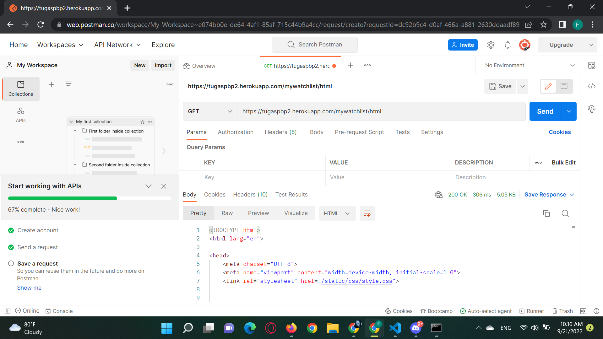
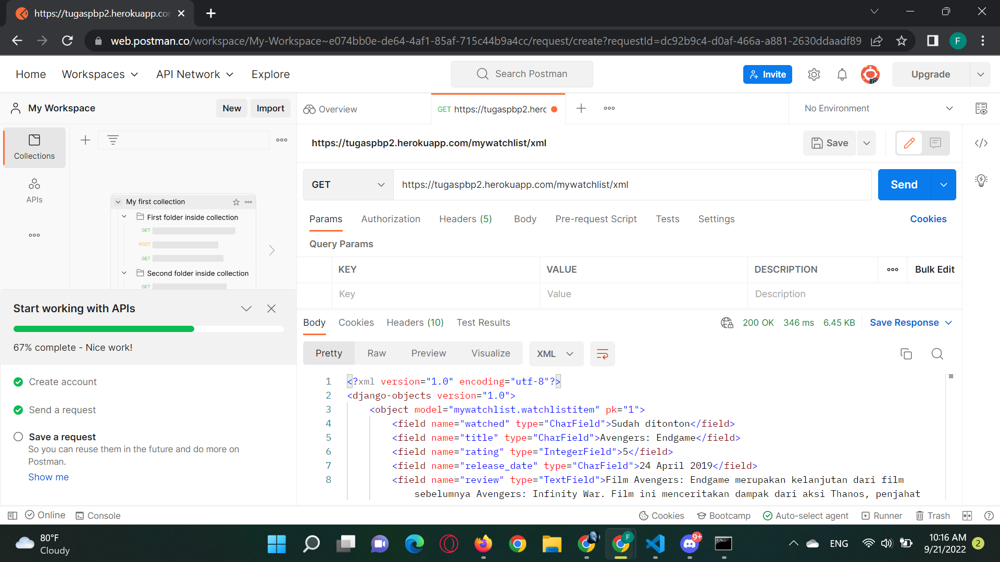
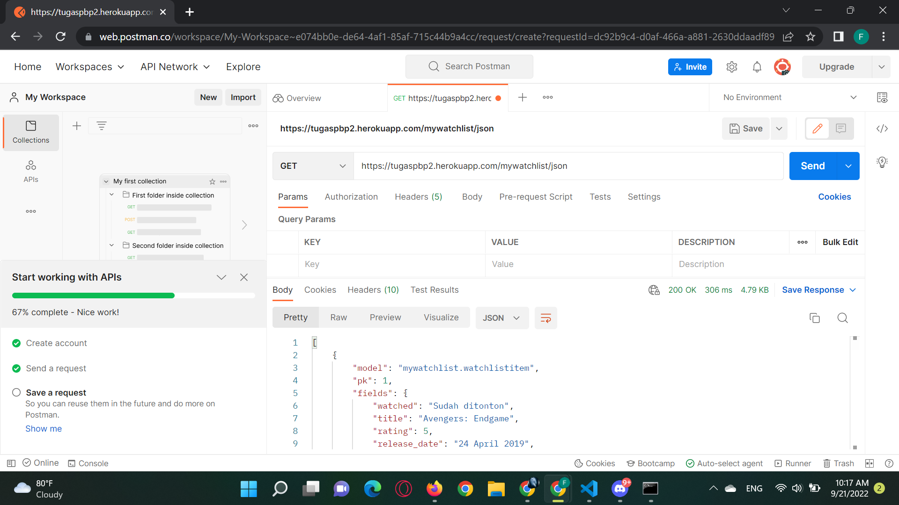

Link untuk app heroku: https://tugaspbp2.herokuapp.com/mywatchlist/

1. HTML: Hyper Text Markup Language adalah bahasa markup standar untuk membuat halaman web, mendeskripsi struktur web secara sematik dan biasanya juga ada isyarat penampilan dokumen
   | JSON: JavaScript Object Notation adalah suatu format yang ditulis dalam Javascript, datanya disimpan dalam bentuk berpasangan key dan value, penyimpanan dengan efisien tetapi tidak enak dilihat, ekstensi file .json, mengambil suatu string JSON, untuk aplikasi AJAX JSON lebih cepat dan mudah dari XML
   | XML: eXtensible Markup Language adalah bahasa markup bukan bahasa pemograman, datanya disimpan dalam bentuk tree structure, case sensitive, penyimpanan dengan cara terstruktur dan mudah dibaca tetapi kurang efisien, ekstensi file .xml, mengambil sebuah dokumen XML, menggunakan XML DOM untuk loop dokumen, mengekstrak value dan menyimpannya dalam variabel

2. Pada saat mengimplementasi sebuah platform data delivery akan digunakan untuk mengirimkan suatu data dari satu stack ke stack lainnya. Data delivery akan menghubungkan browser dengan server, pada saat browser meminta suatu HTML page maka server akan membalikkan sebuah HTML file, saat browser meminta JPG image, maka server membalikkan JPG file, dan lain-lain. Data yang dikirim dapat berupa berbagai bentuk. Beberapa yang sering ditemui adalah XML, JSON, dan HTML. Tanpanya tidak ada data apapun yang ditampilkan atau diberikan ketika adanya permintaan.

3. Implementasi setiap checklist:
Checklist #1: Saya membuat app bernama mywatchlist dengan python manage.py startapp mywatchlist dan menambahkan ke dalam setting di bagian INSTALLED_APPS aplikasi tersebut.

Checklist #2: Saya menambahkan path('', show_watchlist, name='show_watchlist'), dalam urls.py untuk mywatchlist dan juga menambahkan path('mywatchlist/', include('mywatchlist.urls')), pada url.py miliki project_django

Checklist #3: Saya membuat template untuk mywatchlist berupa :



  <h1>Tugas 3 PBP/PBD</h1>

  <h5>Name: </h5>
  
{{nama}}

  <h5>Student ID: </h5>
  
{{student_id}}

  <table>
    <tr>
      <th>Title</th>
      <th>Release Date</th>
      <th>Rating</th>
      <th>Review</th>
      <th>Watched</th>
    </tr>
    
    <tr>
        <th>{{item.title}}</th>
        <th>{{item.release_date}}</th>
        <th>{{item.rating}}</th>
        <th>{{item.review}}</th>
        <th>{{item.watched}}</th>
    </tr>

  </table>



dan menambahkan beberapa hal berikut ke dalam models.py:
class WatchListItem(models.Model):
    watched = models.CharField(max_length=500)
    title = models.CharField(max_length=500)
    rating = models.IntegerField()
    release_date = models.CharField(max_length=500)
    review = models.TextField()

Checklist #4: Saya membuat fixtures yang berisikan initial_watchlist_data.json dan saya isi dengan 10 data terkait mywatchlist, berikut contoh isinya:
[
    {
        "model": "mywatchlist.watchlistitem",
        "pk" : "1", 
        "fields": {
            "title": "Avengers: Endgame",
            "release_date": "24 April 2019",
            "rating": 5,
            "review": "Film Avengers: Endgame merupakan kelanjutan dari film sebelumnya Avengers: Infinity War. Film ini menceritakan dampak dari aksi Thanos, penjahat untuk kedua film yang telah menghapus setengah populasi di semesta dan perjuangan para pahlawan Avengers mencari cara untuk membalikkan keadaan seperti semula. Film ini merupakan film yang diantisipasi oleh setiap penggemar MCU terutama dalam film sebelumnya terdapat cliff hanger.",
            "watched": "Sudah ditonton"
        }
    }
]

Checklist #5: Saya menambahkan beberapa fungsi dalam views untuk menghubungkan ke template sehingga dapat menyajikan data sesuai dengan yang dimau. Berikut potongan fungsinya:
def show_watchlist(request):
    return render(request, "watchlist.html", context)

def xml(request):
    data = WatchListItem.objects.all()
    return HttpResponse(serializers.serialize("xml", data), content_type="application/xml")

def json(request):
    data = WatchListItem.objects.all()
    return HttpResponse(serializers.serialize("json", data), content_type="application/json")

data_watchlist_item = WatchListItem.objects.all()
context = {
    'list_watchlist':data_watchlist_item,
    'nama': 'Felix Tjahyadi',
    'student_id': '2106638614'
}

Checklist #6: Saya menambahkan path untuk setiap bentuk data yang dikirimkan yaitu HTML, XML, dan JSON. Berikut potongan kode yang saya gunakan:
urlpatterns = [
    path('', show_watchlist, name='show_watchlist'),
    path('html', show_watchlist, name='show_watchlist'),
    path('xml', xml, name='xml'),
    path('json', json, name='json'),
]

Checklist #7: Untuk melakukan deploy ke heroku dikarenakan mengerjakan dalam repositori yang sudah pernah dihubungkan dengan Heroku maka pasti sudah memiliki secret yang diperlukan, saya hanya melakukan add, commit, dan push melalui commadn prompt.

Checklist #8: Mengimplementasi test dengan menggunakan beberapa kode berikut:
class MyWatchListTest (TestCase):
    def test_mywatchlist_html_exits(self):
        response = Client().get('/mywatchlist/html')
        self.assertEqual(response.status_code,200)

    def test_mywatchlist_xml_exits(self):
        response = Client().get('/mywatchlist/xml')
        self.assertEqual(response.status_code,200)

    def test_mywatchlist_json_exits(self):
        response = Client().get('/mywatchlist/json')
        self.assertEqual(response.status_code,200)

Screenshot POSTMAN:

